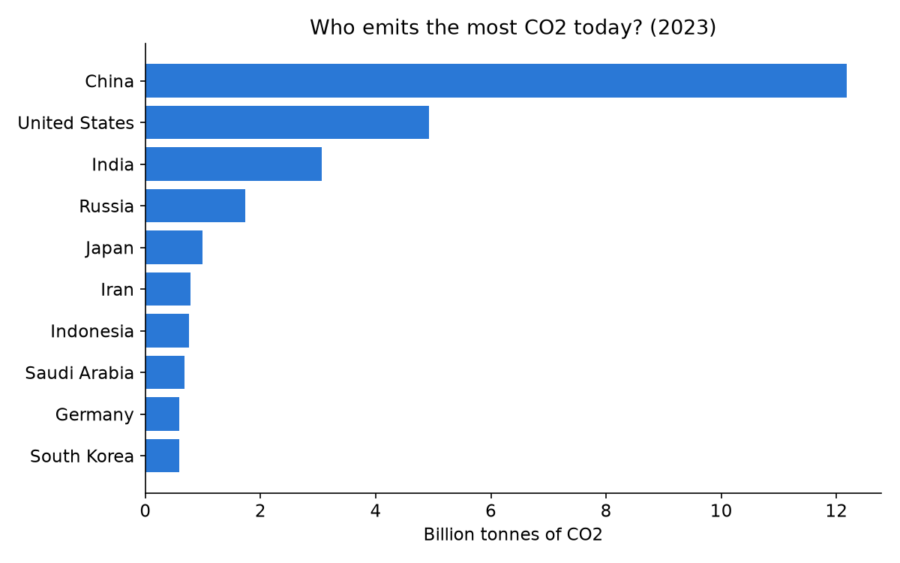
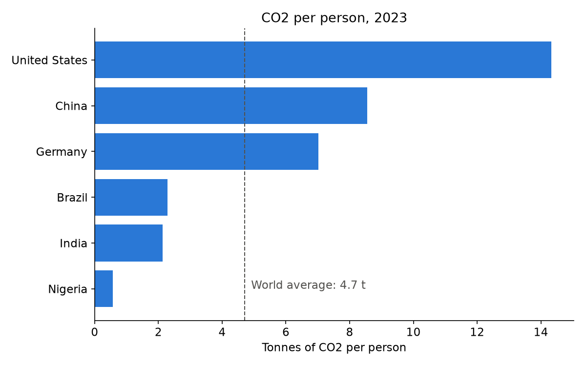
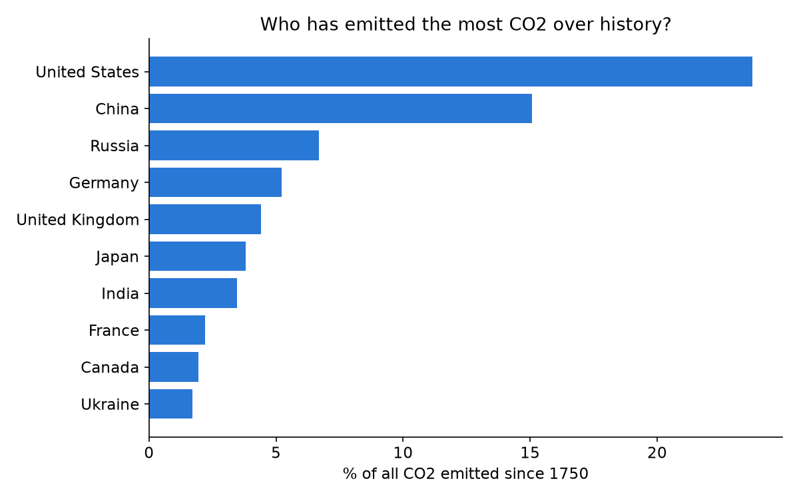
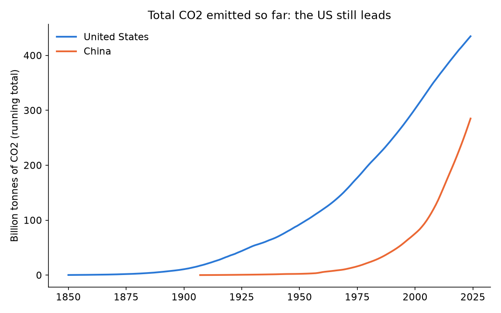
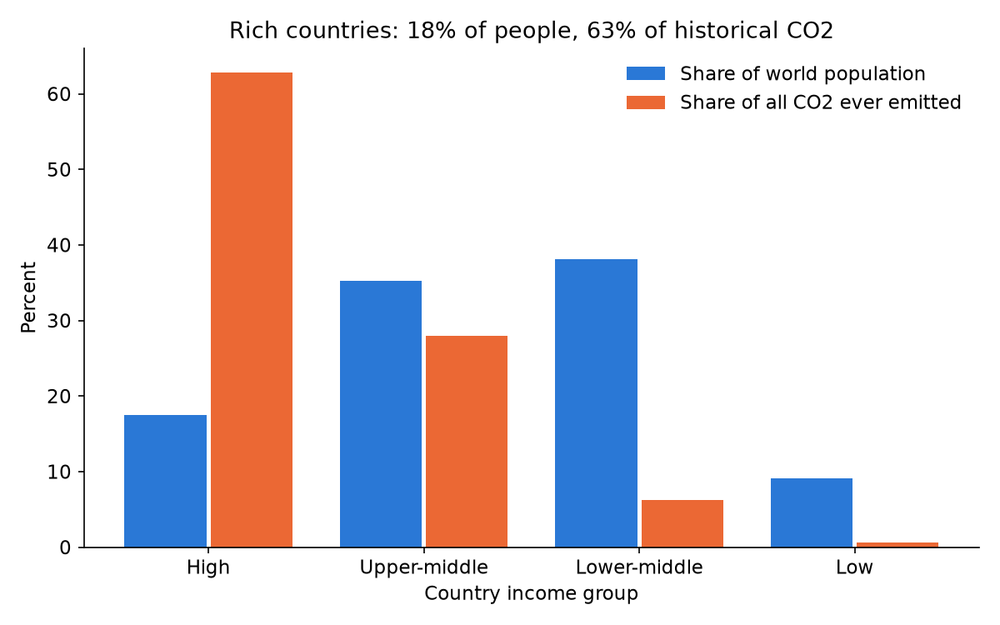
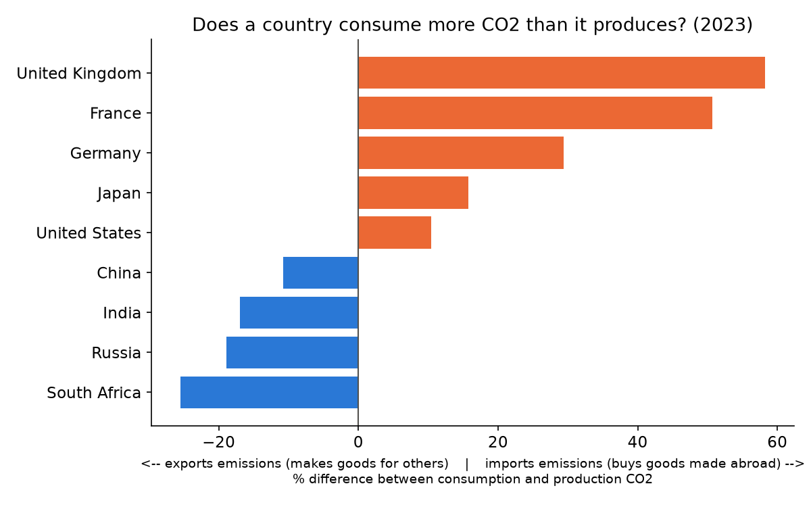

# China Is the World's Biggest Polluter. So Why Do Other Countries Say the US Should Pay?

*A look at four different ways to measure who is responsible for climate change*

## Why this matters

At every climate summit you hear the same argument. Rich countries say China and India
need to cut emissions. Poorer countries say the rich countries caused the problem and
should pay to fix it. Both sides point to "the data." So who's right?

This post is for anyone who has heard these debates in the news and wondered why
countries can't even agree on the basic facts. I found that the answer depends on
**which question you ask**. I used a public dataset from Our World in Data that tracks CO2
emissions for every country back to 1750.

## Question 1: Who emits the most right now?

This is the number you usually see in headlines. In 2023 China emitted **32%** of the world's
CO2 from fossil fuels and industry, about 2.5 times the United States (13%). India came third with 8%.
If this were the only chart, the story would be simple: China is the problem.

## Question 2: What about per person?

China has about 1.4 billion people and the US has about 340 million. So what happens if
I divide by population?

The ranking flips. The average American emits **14.3 tonnes** of CO2 a year, about **3 times
the world average** (4.7 t). The average person in China emits 8.6 t, India 2.1 t, and Nigeria
just 0.6 t. An average American emits about as much in two weeks as an
average Nigerian does in a whole year.

## Question 3: Who has emitted the most over history?

CO2 stays in the atmosphere for hundreds of years, so the warming we feel today comes from
emissions added up over time, not just this year's.

The **United States has emitted almost a quarter (23.7%) of all CO2 since 1750**. That's more
than any other country. China is second at 15%, even though China only passed the US in
yearly emissions in 2006.

China's line is climbing fast, but the US had a 100-year head start.

I also grouped countries by income level:

This was the most surprising chart for me. **High-income countries hold 18% of the world's
people but produced 63% of all historical CO2.** Low-income countries hold 9% of the world's people
and produced **less than 1%**. To measure this I made a "fair share ratio": a country's share of historical
CO2 divided by its share of the world's population. The US scores 5.6, meaning it emitted over
five times its "fair share." India scores 0.2 and Nigeria 0.1.

## Question 4: Who is the pollution really for?

When a factory in China makes a phone that is sold in London, whose emissions are those?
Official numbers count them for China. The dataset also has a **consumption-based** estimate,
which counts emissions in the country where the stuff is bought.

The UK's consumption footprint is **58% higher** than what it emits at home. France is 51%
higher and Germany 29% higher. China, India, Russia and South Africa go the other way: part of
their emissions come from making things for other countries. Some of the progress rich
countries have made has come from moving factories abroad.

## What's the takeaway?

There isn't one "correct" way to measure responsibility. Each chart answers a different question:

- **Total today** tells us where cutting emissions will have the biggest effect *now*. China matters a lot here.
- **Per person and historical** tell us who has benefited most from burning fossil fuels.
  That's mostly rich countries, led by the US.
- **Consumption** reminds us that rich countries' footprints are bigger than the official numbers.

When a politician says "we're not the problem, look at country X," check which of these
measures they are using.

## Limitations, bias, and ethics

I want to be upfront about what this data can and can't tell you:

- **Countries aren't people.** A national average hides huge differences. A wealthy person in India
  can emit far more than a poor person in the US. Blaming "China" or "India" as a whole can
  be unfair to the millions of people there who emit very little.
- **Consumption numbers are estimates.** They come from economic trade models, not direct
  measurement, and only exist for about 120 countries.
- **Old data is rough.** Numbers from the 1800s are rebuilt from historical coal and oil records.
- **Borders change.** Emissions from the old Soviet Union get split across today's countries,
  and colonial-era emissions are counted for the territory, not the empire that controlled it.
- **Only CO2 from fossil fuels and industry.** I left out deforestation and other gases like
  methane. Including deforestation would raise the numbers for countries like Brazil and Indonesia.
- **Choosing the measure is itself a choice with consequences.** Each country tends to prefer
  the measure that makes it look best. I tried to show all of them side by side instead
  of picking one.

## Data and code

All code and data are on GitHub: https://github.com/dushben/co2-data-story
Data: Our World in Data, CO2 and Greenhouse Gas Emissions dataset (https://github.com/owid/co2-data), CC BY 4.0.
